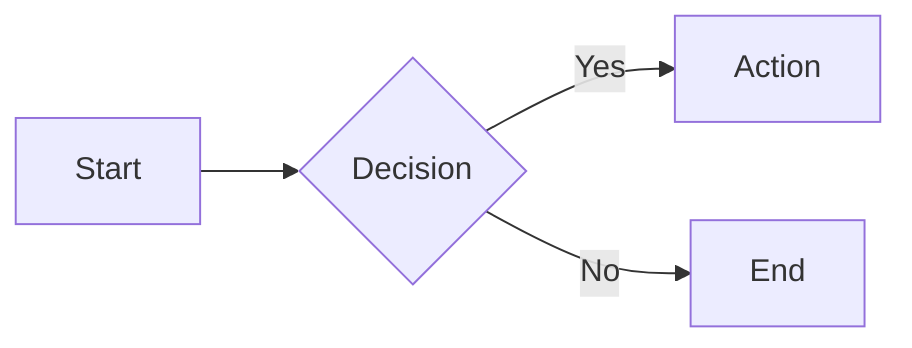
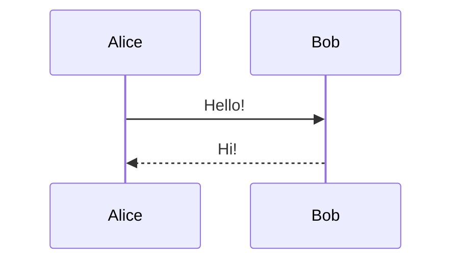

# Slidev Reference

Full cheat sheet for slide syntax, layouts, components, animations, and CLI.

---

## Headmatter (Deck-level Config)

```yaml
---
theme: seriph                # Theme: seriph | default | apple-basic | bricks
title: My Talk
transition: slide-left       # Default slide transition
mdc: true                    # Enable MDC inline component syntax
lineNumbers: false
colorSchema: auto            # auto | light | dark
aspectRatio: 16/9
canvasWidth: 980
fonts:
  sans: Inter
  mono: Fira Code
  provider: google
drawings:
  persist: false
defaults:
  layout: default
---
```

---

## Per-Slide Frontmatter

```yaml
---
layout: center           # Layout name (see table below)
background: /image.png   # Background image/color
class: text-white        # CSS class on slide wrapper
transition: fade         # Override transition for this slide
clicks: 3                # Manual total click count
hideInToc: false         # Hide from <Toc> component
routeAlias: my-slide     # URL alias / <Link to="my-slide">
zoom: 0.8                # Scale content
---
```

---

## All Built-in Layouts

| Layout | Description |
|--------|-------------|
| `default` | Basic content layout |
| `cover` | Title/cover page (auto-used for first slide) |
| `center` | Centered content |
| `end` | Final slide |
| `fact` | Prominent fact/statistic |
| `full` | Full screen, no padding |
| `image` | Full-screen image as main content |
| `image-left` | Image left, content right |
| `image-right` | Image right, content left |
| `iframe` | Embedded webpage as main content |
| `iframe-left` | Webpage left, content right |
| `iframe-right` | Webpage right, content left |
| `intro` | Introduction page |
| `none` | No styling |
| `quote` | Prominent quotation |
| `section` | Section divider |
| `statement` | Large statement text |
| `two-cols` | Two equal columns |
| `two-cols-header` | Header row, then two columns |

### Two-column Slot Syntax

```md
---
layout: two-cols
---

# Left column content

::right::

# Right column content
```

```md
---
layout: two-cols-header
---

This spans both columns

::left::

Left content

::right::

Right content
```

### Image Layout Options

```yaml
---
layout: image-right
image: /path/to/image.png
backgroundSize: contain   # or: cover (default) | auto | 50%
---
```

### Iframe Layout

```yaml
---
layout: iframe
url: https://example.com
---
```

---

## Slide Separators

```md
# Slide 1

Content here

---

# Slide 2

Content here
```

---

## Presenter Notes

```md
# Slide Title

Content here

<!-- This is a presenter note. Supports **markdown**. -->
```

Multi-line notes:
```md
<!--
First paragraph of notes.

Second paragraph of notes.

[click] Notes for after first click
[click] Notes for after second click
-->
```

---

## Code Blocks

### Basic Highlighting

```md
```ts
const x: number = 42
```
```

### Line Highlighting

```md
```ts {2,3}       ← highlight lines 2 and 3
```ts {1-3,5}     ← range + specific line
```ts {all}       ← highlight all
```ts {none}      ← no highlight
```ts {hide}      ← hidden initially
```

### Click-step Highlighting

```md
```ts {1|3-5|all}
// Highlights line 1, then 3-5, then all — on each click
```

### Line Numbers

```md
```ts {lines:true,startLine:10}
```

### Max Height (scrollable)

```md
```ts {maxHeight:'200px'}
```

### Monaco Editor (live editable)

```md
```ts {monaco}
```

### Monaco Diff

```md
```ts {monaco-diff}
original code
~~~
modified code
```

### Monaco Run (executable)

```md
```ts {monaco-run}
console.log('runs in browser')
```

### Shiki Magic Move (animated transitions)

````md
````md magic-move
```js
const x = 1
```
```ts
const x: number = 1
```
````
````

### Import External Snippet

```md
<<< @/snippets/example.ts
<<< @/snippets/example.ts#region
<<< @/snippets/example.ts ts {2,3}
```

---

## Animations

### v-click — Show on click

```md
<v-click>
Content shown after one click
</v-click>

<div v-click>Or on an element</div>
```

### v-after — Show with previous click

```md
<div v-click>First</div>
<div v-after>Shown at same time as First</div>
```

### v-clicks — Apply to all children

```md
<v-clicks>

- Item 1 (shown on click 1)
- Item 2 (shown on click 2)
- Item 3 (shown on click 3)

</v-clicks>
```

With nested depth:
```md
<v-clicks depth="2">

- Parent
  - Child (also animated)

</v-clicks>
```

### v-click.hide — Hide on click

```md
<div v-click.hide>Visible, then hidden on click</div>
```

### Click at specific index

```md
<div v-click="3">Shown after 3rd click</div>
```

### Click range (enter + leave)

```md
<div v-click="[2, 4]">Visible only during clicks 2–3</div>
```

### v-switch — Mutually exclusive slots

```md
<v-switch>
  <template #1>Shown at click 1</template>
  <template #2>Shown at click 2</template>
  <template #3-5>Shown at clicks 3–5</template>
</v-switch>
```

### v-mark — Rough annotation

```md
<span v-mark.underline.red="1">underlined on click 1</span>
<span v-mark.circle.orange>circled</span>
<span v-mark.highlight.yellow>highlighted</span>
```

Types: `underline`, `circle`, `highlight`, `strike-through`, `crossed-off`, `bracket`

### v-motion — Enter/exit animations

```html
<div
  v-motion
  :initial="{ x: -80, opacity: 0 }"
  :enter="{ x: 0, opacity: 1 }"
  :leave="{ x: 80, opacity: 0 }"
>
  Animated element
</div>
```

---

## Slide Transitions

Set globally in headmatter or per-slide in frontmatter:

```yaml
transition: slide-left
```

Built-in options:
- `fade` — Crossfade
- `fade-out` — Fade out, then fade in
- `slide-left` — Slides left (slides right going back)
- `slide-right` — Slides right
- `slide-up` — Slides up
- `slide-down` — Slides down
- `view-transition` — Uses browser View Transitions API

Different transitions forward/backward:
```yaml
transition: go-forward | go-backward
```

---

## Built-in Components

```md
<!-- Arrow between coordinates -->
<Arrow x1="10" y1="10" x2="200" y2="200" color="red" width="2" />

<!-- Embed YouTube -->
<Youtube id="VIDEO_ID" />

<!-- Embed Tweet -->
<Tweet id="TWEET_ID" />

<!-- Table of contents -->
<Toc columns="2" maxDepth="2" />

<!-- Navigate to a slide -->
<Link to="42">Go to slide 42</Link>
<Link to="my-alias">Go to named slide</Link>

<!-- Show/hide for light vs dark mode -->
<LightOrDark>
  <template #light>Light mode content</template>
  <template #dark>Dark mode content</template>
</LightOrDark>

<!-- Scale/transform wrapper -->
<Transform :scale="0.8" origin="top left">
  <YourBigComponent />
</Transform>

<!-- Draggable element (define position in frontmatter dragPos) -->
<VDrag name="my-element">Draggable</VDrag>

<!-- Current slide / total -->
<SlideCurrentNo /> / <SlidesTotal />

<!-- Powered by badge -->
<PoweredBySlidev />
```

---

## LaTeX / KaTeX

Inline: `$E = mc^2$`

Block:
```md
$$
\nabla \cdot \vec{E} = \frac{\rho}{\varepsilon_0}
$$
```

With click-step highlighting:
```md
$$ {1|2|all}
line 1 \\
line 2
$$
```

---

## Mermaid Diagrams

```md



```

---

## MDC Syntax (requires `mdc: true` in headmatter)

```md
Inline: This is [red text]{style="color:red"}.

Image with size: {width=400px}

Block component:
::block-component{prop="value"}
Default slot content
::
```

---

## Importing External Slides

```yaml
---
src: ./other-slides.md
---
```

Import specific slide range:
```yaml
---
src: ./other.md#2,5-7
---
```

---

## Scoped CSS (per-slide)

```md
# My Slide

<style>
h1 { color: red; }
</style>
```

---

## CLI Commands

```bash
# Dev server
bunx @slidev/cli [slides.md] --open --port 3030

# Build static SPA
bunx @slidev/cli build [slides.md] --out dist

# Export to PDF (needs playwright-chromium)
npm i -D playwright-chromium
bunx @slidev/cli export [slides.md]
bunx @slidev/cli export --format pptx
bunx @slidev/cli export --format png
bunx @slidev/cli export --with-clicks     # one page per click step
bunx @slidev/cli export --range 1,3-5

# Format markdown structure
bunx @slidev/cli format [slides.md]

# Eject theme for customization
bunx @slidev/cli theme eject
```

---

## Directory Structure (optional conventions)

```
~/presentations/<topic>/
  slides.md          # Main slides file
  components/        # Custom Vue components (auto-imported)
  layouts/           # Custom layout overrides
  public/            # Static assets served at /
  snippets/          # Code snippets for <<< import
  styles/            # Global CSS (style.css or styles/index.css)
```
